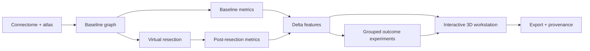

# NeuroResect

**Explore how virtual resection changes a brain network. Trace every result back to its inputs.**

NeuroResect is a research platform for structural-connectome analysis, virtual resection, patient-separated outcome experiments, and interactive 3D exploration. It is under active, phased development from the supplied [HLD](docs/HLD.txt) and [LLD](docs/LLD.txt).

The first release uses explicitly labeled synthetic data and includes an import path for de-identified research connectomes. **Research prototype: not validated for clinical decisions or surgical recommendations.**

Follow [the delivery plan](docs/DELIVERY_PLAN.md), [API contract](docs/API_CONTRACT.md), and [architecture decisions](docs/adr). Setup, screenshots, scientific methods, and deployment documentation will accompany the implementation phases.
