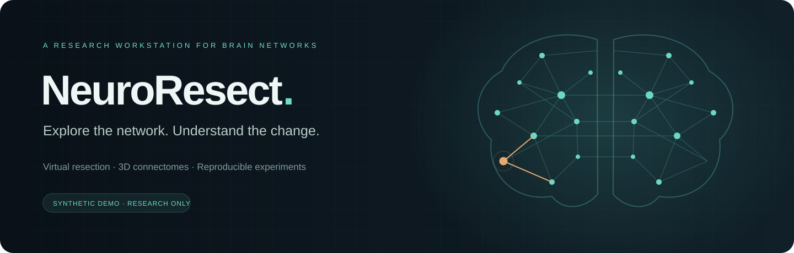
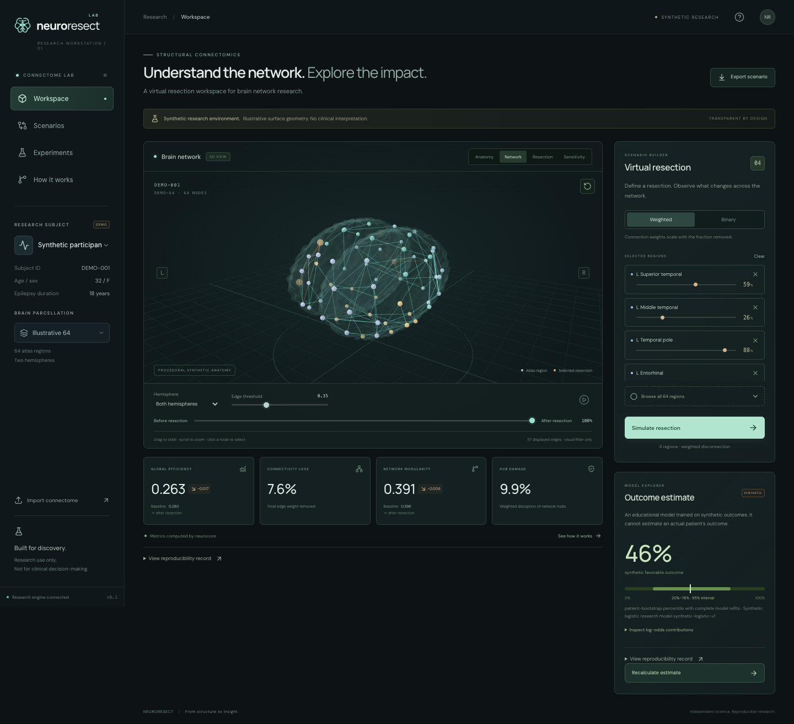
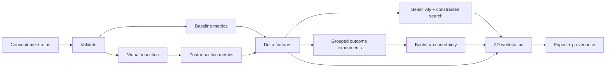
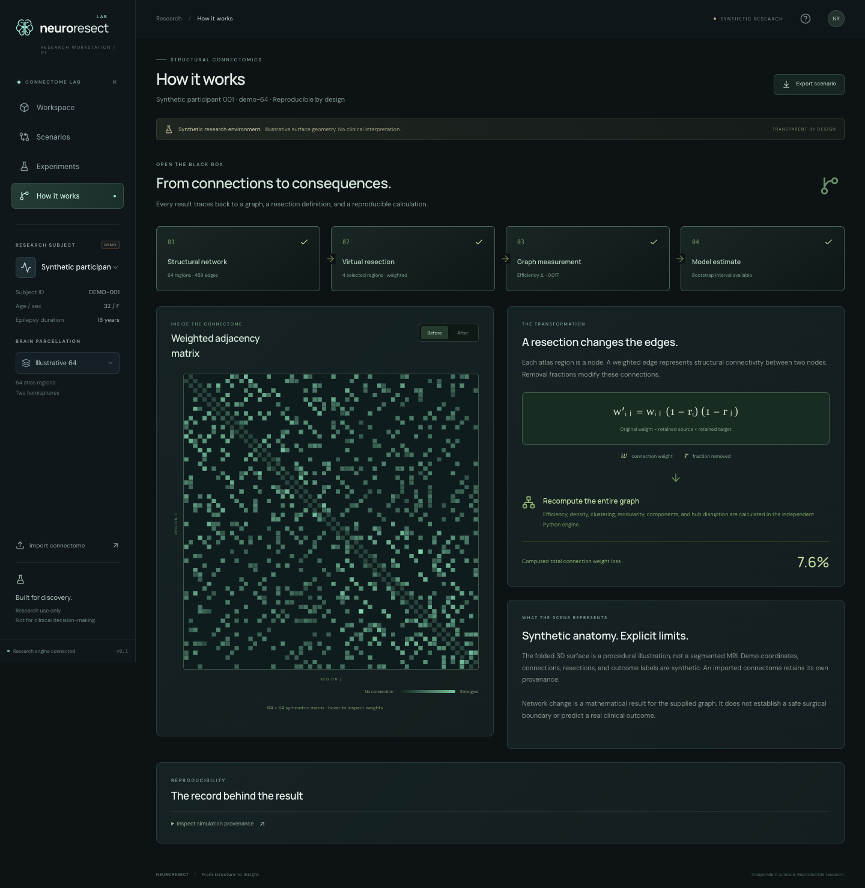
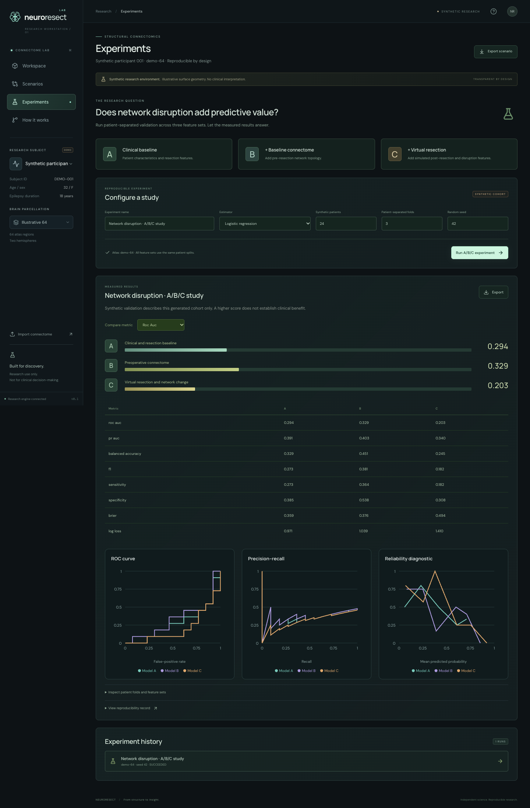
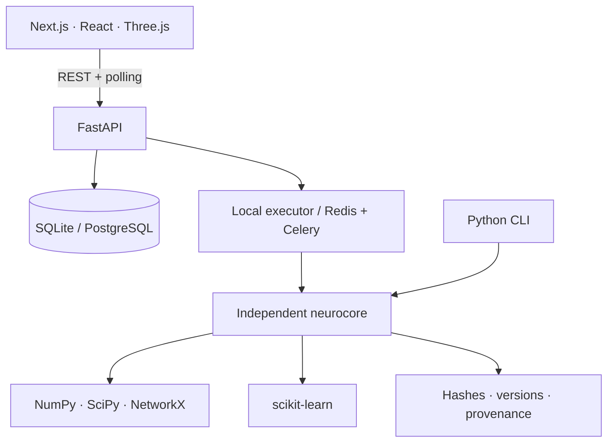

<p align="center"></p>

[](https://github.com/AbhishekNazare/neuroresect/actions/workflows/ci.yml)


**NeuroResect investigates how virtual resections change structural brain networks.** Edit removal fractions, explore a 3D connectome, inspect graph changes, test alternatives, and run reproducible patient-separated experiments through one independent Python engine.

> **Research only.** Bundled anatomy, connectomes, resections, and outcomes are synthetic. This platform is not clinically validated and does not recommend surgery. Imported connectomes support graph analysis; the bundled synthetic-trained outcome model cannot score them.

[Quick start](#quick-start) · [Methods](docs/SCIENCE.md) · [Architecture](docs/ARCHITECTURE.md) · [Import data](docs/DATA_IMPORT.md) · [Experiments](docs/EXPERIMENTS.md)

## The workstation



- **Explore:** orbit a procedural cortex, inspect regions, filter drawn edges, and switch between two synthetic atlas resolutions.
- **Simulate:** select regions in 3D or with the keyboard editor, adjust fractions, and animate before/after network changes.
- **See the evidence:** efficiency, connectivity loss, modularity, hub damage, uncertainty, and provenance come from backend computations.
- **Test alternatives:** compare saved scenarios, perturb fractions, inspect a sensitivity heatmap, and search with target-fraction/protected-region constraints.
- **Inspect the internals:** view the actual adjacency matrix, equations, computation stages, and input/configuration hashes.
- **Run studies:** compare clinical/resection (A), baseline graph (B), and virtual-resection (C) features on shared patient-separated folds.

Responsive layouts, reduced motion, keyboard controls, WebGL fallback, and explicit error/loading states are included. Editing or switching subjects invalidates old results. The display edge threshold changes the drawing only.

## Quick start

Use **Python 3.14**, **Node.js 24 LTS**, and npm. CPU execution is sufficient; WebGL enables the 3D view. Python constraints and the npm lockfile record tested dependency versions.

```sh
git clone https://github.com/AbhishekNazare/neuroresect.git
cd neuroresect
python3.14 -m venv .venv
.venv/bin/python -m pip install -r requirements-dev.txt
npm ci
```

Start the API:

```sh
.venv/bin/uvicorn neuroresect_api.main:app --reload --host 127.0.0.1 --port 8000
```

In a second terminal:

```sh
npm run dev
```

Open **http://localhost:3000**. API documentation is at **http://localhost:8000/docs**. No account, private dataset, API key, or pretrained download is required. Twelve synthetic subjects are available immediately; experiments generate larger deterministic cohorts on demand.

### A first exploration

1. Choose a subject and **Illustrative 64** atlas.
2. Adjust region fractions and click **Simulate resection**.
3. Move the before/after slider and inspect the metrics.
4. Choose **Estimate synthetic outcome** to see bootstrap refit variability.
5. Open **Scenarios** for sensitivity and constrained alternatives.
6. Open **How it works** for the matrix/provenance, or **Experiments** for A/B/C validation.
7. Export the scenario or experiment.

### Containers

With Docker running:

```sh
NEURORESECT_GIT_COMMIT=$(git rev-parse HEAD) docker compose up --build
```

Compose launches web, FastAPI, a Celery worker, PostgreSQL, and Redis. Web/API ports bind to localhost; queue/database ports stay internal. Named volumes preserve state. This is a local research deployment without lab identity management. [Operations guide →](docs/DEVELOPMENT.md)

## From connections to consequences



Weighted resection attenuates both endpoints:

```text
new_weight[i,j] = original_weight[i,j] × (1 − fraction[i]) × (1 − fraction[j])

Example: 0.8 × (1 − 0.4) × (1 − 0.2) = 0.384
```

Binary fractions of at least 0.5 remove incident connections. Both methods retain the original node universe so metric denominators remain comparable. Distances use reciprocal positive strength; unreachable pairs contribute zero efficiency. These graph perturbations do not simulate seizures, recovery, or tissue deformation.



The inspectable [four-region example](examples/connectome.json) produces:

| Quantity | Before | After |
| --- | ---: | ---: |
| Undirected edge weight | 2.400 | 1.724 |
| Weighted efficiency | 0.453535 | 0.320241 |
| Density | 0.833333 | 0.833333 |
| Connectivity loss | — | 28.1667% |

Partial weakening can leave density unchanged while reducing efficiency. Reproduce it:

```sh
.venv/bin/neuroresect simulate --input examples/connectome.json \
  --regions examples/resection.json --output artifacts/example-simulation.json
```

## Experiments and uncertainty

The research question is whether virtual-resection features add information beyond patient/resection characteristics and preoperative connectivity.

| Comparison | Inputs |
| --- | --- |
| A — Clinical/resection | Age, synthetic sex variable, duration, resection fractions |
| B — Baseline connectome | A + preoperative graph features |
| C — Virtual resection | B + simulated post-resection and delta features |

Logistic regression, random forest, and SVM use fold-local preprocessing and patient-grouped validation. All feature sets share folds. Exports include held-out probabilities, memberships, ROC/PR curves, reliability diagnostics, and multiple metrics. Leakage guards reject overlapping patients, shared scans, duplicated rows, and unapproved outcome-derived features.



An actual run of `configs/experiments/synthetic-abc.json` (36 synthetic subjects, 3 folds, seed 42, logistic regression) produced:

| Model | ROC-AUC | Average precision | Balanced accuracy | Brier ↓ |
| --- | ---: | ---: | ---: | ---: |
| A | 0.2941 | 0.3753 | 0.3669 | 0.3420 |
| B | 0.2910 | 0.3717 | 0.3344 | 0.3667 |
| C | 0.2879 | 0.3658 | 0.4226 | 0.3638 |

**This example shows no predictive improvement.** Values are reported as measured, not selected for a favorable story. Synthetic labels do not establish clinical utility. Screenshot experiments may use a different cohort size, shown in their configuration.

Scenario estimates exclude the selected subject from training and use **64 patient-bootstrap refits**. The 95% percentile interval describes refit variability, not guaranteed individual-outcome coverage. Explanations are linear log-odds contributions; calibration is not externally validated.

```sh
.venv/bin/neuroresect experiment configs/experiments/synthetic-abc.json \
  --output artifacts/study
.venv/bin/neuroresect reproduce artifacts/study/experiment.json \
  --output artifacts/reproduced
```

```text
artifacts/study/
├── config.json
├── experiment.json
├── metrics.json
├── predictions.csv
├── feature_importance.csv
├── models.joblib
└── provenance.json
```

[Experiment methods and artifact interpretation →](docs/EXPERIMENTS.md)

## Architecture



```text
apps/web/                 Workstation, research panels, browser tests
apps/api/                 API, persistence, job orchestration
packages/neurocore/       Scientific engine, experiments, CLI
workers/                 Celery adapter
configs/experiments/      Versioned study configurations
tests/                   Scientific and API tests
examples/                Inspectable import examples
infrastructure/docker/   API and web images
docs/                    Designs, decisions, methods, screenshots
```

Jobs persist queued/running/succeeded/failed states. Idempotency keys replay the original scoped job; they are not a cross-version scientific cache. [Architecture and sequence diagrams →](docs/ARCHITECTURE.md)

## Bring a connectome

Use **Import connectome** or:

```sh
curl --fail-with-body http://localhost:8000/api/v1/datasets/import \
  -H 'Content-Type: application/json' \
  --data-binary @examples/connectome.json
```

JSON includes explicit atlas nodes, an ordered symmetric matrix, dataset/patient IDs, fractions, and a de-identification acknowledgment. CSV plus metadata is supported by the CLI. Incompatible data is rejected. [Contract and limits →](docs/DATA_IMPORT.md)

## Validation and development

```sh
.venv/bin/ruff check packages apps/api workers tests
.venv/bin/mypy packages/neurocore/neurocore apps/api/neuroresect_api
.venv/bin/pytest
npm run typecheck
npm run build
npx playwright install chromium
npm run test:e2e
docker compose config --quiet
```

The release was checked with **59 Python tests**, static checks, a production build, and **3 browser workflows** covering real computations, stale-state invalidation, exports, experiments, mobile layout, keyboard help, and errors. GitHub Actions additionally builds containers. CI is the authoritative check record for each commit.

See [contribution guidance](CONTRIBUTING.md), [operations](docs/DEVELOPMENT.md), and [delivery plan](docs/DELIVERY_PLAN.md). Named branches and merged PRs preserve the implementation history:

1. [Research foundations](https://github.com/AbhishekNazare/neuroresect/pull/1)
2. [Deterministic virtual resection](https://github.com/AbhishekNazare/neuroresect/pull/2)
3. [Patient-separated experiments](https://github.com/AbhishekNazare/neuroresect/pull/3)
4. [Persistent research API](https://github.com/AbhishekNazare/neuroresect/pull/4)
5. [Interactive 3D workstation](https://github.com/AbhishekNazare/neuroresect/pull/5)
6. [Release toolkit and illustrated guide](https://github.com/AbhishekNazare/neuroresect/pull/6)

## Scope and next research steps

| Available | Requires additional work/assets |
| --- | --- |
| Synthetic 64/96-region atlases and imports | Registered anatomical surfaces and cross-atlas mapping |
| Weighted/binary graph resections | Tract intersections and voxel-mask expansion |
| Fraction sensitivity and constrained alternatives | Anatomical tissue coverage and clinical constraints |
| Synthetic A/B/C studies and bootstrap estimates | Approved real cohort, harmonized endpoints, external validation |
| SQLite and PostgreSQL/Celery deployment | Lab OIDC, tenancy, governed storage/audit retention |
| Self-contained artifacts and provenance | MLflow, DVC, and object-store integrations |
| DWI connectome inputs | Raw MRI preprocessing and MEG/fMRI/HGM/EEG pipelines |

The original [HLD](docs/HLD.txt) and [LLD](docs/LLD.txt) remain unchanged. [Architecture decisions](docs/adr) explain deviations. A visually clinical interface does not make this a clinically validated system.
