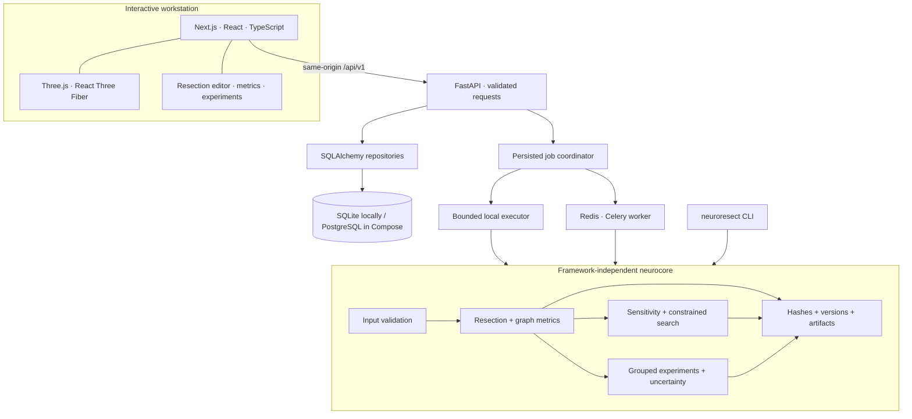
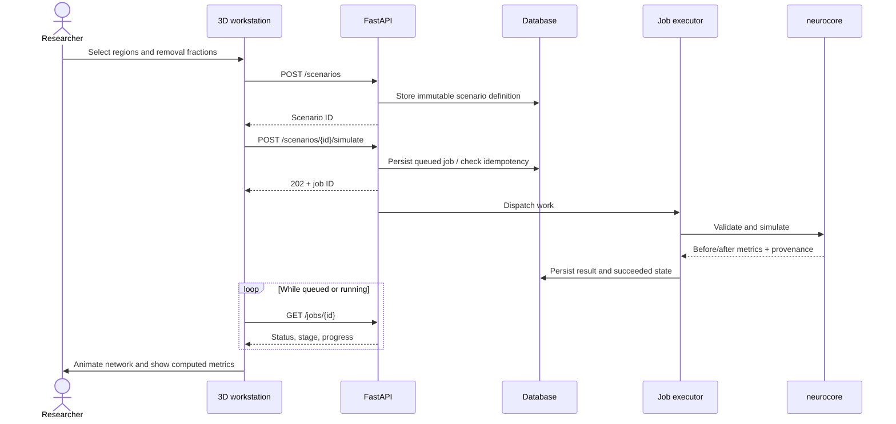
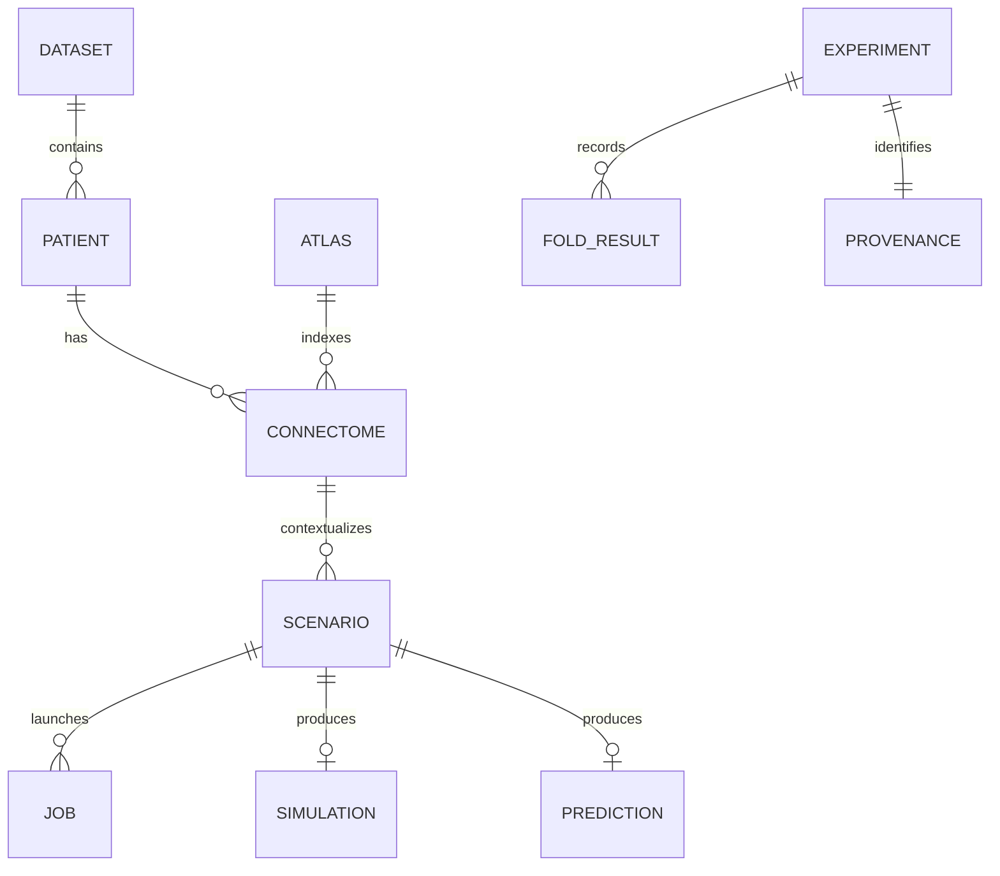

# Architecture

NeuroResect has two entry points into one scientific engine: the research workstation and the command line. Browser code never calculates the authoritative scientific result.

## A simulation request

Switching patient/atlas or editing a scenario invalidates visible old results. Requests belonging to an old selection must not overwrite the current workspace. A failed job is shown as a failure, never replaced with demo numbers.

## Data and result identity

This diagram represents domain relationships, not a promise of one SQL table per entity. Prototype persistence uses typed records plus structured JSON scientific payloads. Source hashes cover the matrix and atlas metadata; configuration hashes cover operations. Database IDs alone are insufficient provenance.

## Deployment boundaries

The local executor is for a single API process. The container deployment moves execution into Celery and uses PostgreSQL. Redis and PostgreSQL are internal Compose services; only the web and API ports bind to localhost. The provided configuration is a development/research deployment, without lab identity or tenancy.

The HLD also describes MinIO, MLflow, and DVC. This release keeps artifact exports and provenance self-contained so a research workflow does not require those services. Object-store and experiment-tracker integrations, anatomical meshes, raw imaging preprocessing, and additional modalities remain explicit extensions rather than disconnected placeholder services.

See [architecture decisions](adr), [API contract](API_CONTRACT.md), and [scientific methods](SCIENCE.md).
