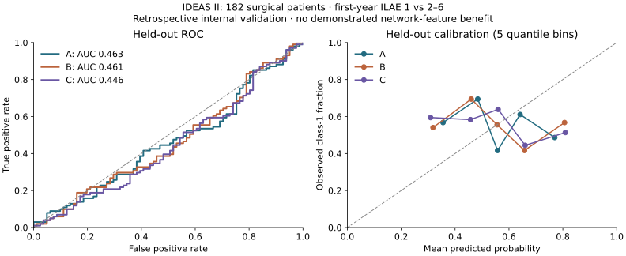

# First real-data outcome experiment

The initial IDEAS II benchmark has been fitted and evaluated on the [audited 182-patient cohort](IDEAS_COHORT.md). These are actual source outcomes and connectivity matrices, not synthetic examples. This is a retrospective internal baseline, **not a validated prediction service**.

```sh
.venv/bin/neuroresect ideas-experiment configs/experiments/ideas-year1.json \
  --output artifacts/ideas-year1-baseline
```

The cohort SHA-256 is pinned in the configuration. Regenerate the same cohort with the documented paths or explicitly version the configuration when moving/changing it. Source network bytes and individual matrix hashes are verified again before feature extraction. No anatomy is fabricated to pass the workstation's coordinate requirements.

## Design

The endpoint is reported `ILAE_Year1 == 1` versus classes 2–6. All three comparisons use the same 182 patients, five stratified patient-separated folds, seed 42, logistic regression with C=1 and a fixed 0.5 decision threshold. No hyperparameter search or feature selection was conducted. Median imputation, scaling, and categorical encoding are fitted exclusively on each training fold. Each patient receives exactly one held-out prediction.

| Model | Features |
| --- | --- |
| A | Sex, onset-age category, scan-age category, number of ASMs; regional resection fraction sum, fraction of regions affected, left-hemisphere fraction share |
| B | A plus preoperative efficiency, density, clustering, modularity, mean node strength |
| C | B plus simulated efficiency, clustering, modularity, efficiency/modularity changes and connectivity loss |

Age categories retain the source bins. The sum of regional fractions is a dimensionless feature, not resection volume. Weighted simulation applies `W'[i,j] = W[i,j] (1-f[i]) (1-f[j])`. Actual postoperative resection definitions and the documented fractional-unit assumption make this retrospective. Histopathology, surgical free text and outcome columns are never input features.

## Observed results

| Model | Held-out ROC-AUC | Average precision | Balanced accuracy | Brier score |
| --- | ---: | ---: | ---: | ---: |
| A | 0.4627 | 0.5521 | 0.4304 | 0.2771 |
| B | 0.4609 | 0.5367 | 0.4625 | 0.2875 |
| C | 0.4458 | 0.5257 | 0.4760 | 0.2942 |



The baseline shows **no useful discrimination or improvement from the added network features**. The C-minus-A AUC difference is −0.0169. A paired bootstrap of fixed out-of-fold predictions gives a conditional 95% interval of approximately [−0.0606, 0.0267]. This resamples patients without refitting models and does not represent uncertainty from repeating the complete training process. It is not evidence of equivalence or clinical usefulness.

The calibration graph assesses held-out probabilities; no recalibration model has been fitted. Neither the average-precision value nor F1 alone establishes useful performance with this class balance (101/182 positives). No model is enabled for real-patient UI predictions.

## Artifacts and reproduction

The artifact directory contains `results.json` (fold assignments, metrics, reliability bins, coefficients, provenance and predictions), `predictions.csv`, `feature-records.json`, the exact config, and final all-cohort fitted pipelines in `models.joblib`. Final fits are saved for reproducibility; evaluation uses only the separate out-of-fold predictions. Joblib files should only be loaded from trusted local sources.

Repeat the command into a different output directory to reproduce the feature-record hash, fold assignments and predictions. Runtime package versions and scientific source-code hashes accompany the result. Keep patient-level artifacts and models outside Git; only aggregate figures and findings are committed.

To regenerate the figure:

```sh
.venv/bin/pip install -e './packages/neurocore[plots]'
.venv/bin/python scripts/plot_real_study.py artifacts/ideas-year1-baseline/results.json \
  --output docs/assets/ideas-year1-results.svg
```

## Remaining research and product work

Confirm source resection units and anatomical registration against imaging; investigate acquisition/protocol confounding and missingness; pre-specify any new feature/model comparisons and use nested validation for tuning. Independent external validation, fitted calibration, registered model serving, actual anatomical surfaces and UI integration remain outstanding. Negative baseline findings must not be replaced by selecting whichever split or experiment scores best.
